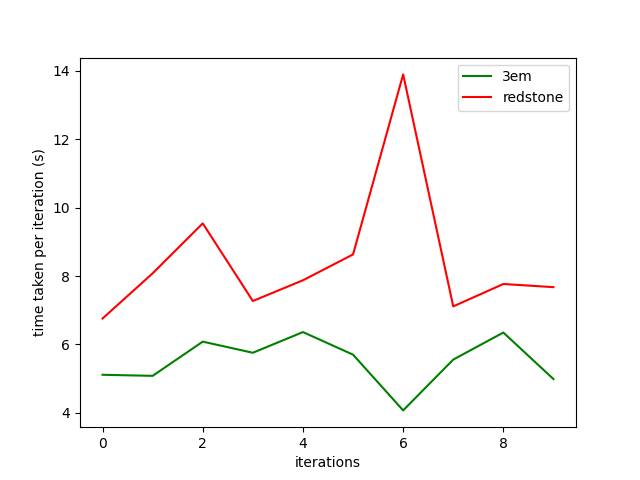

## Setup

```bash
$ git clone https://github.com/three-em/3em.git

$ cd 3em_bench/
$ cargo build --release
# On arm64 M1, append `--target aarch64-apple-darwin`

$ cd ../

$ cd redstone_bench/
$ yarn install

$ cd ../

# optional: for plotting results
$ pip install numpy matplotlib
```

## End user benchmarks

These benchmarks are what **you* as a CLI end-user care should care about the most.

Measures:
* Startup time
* Filesystem cache
* Execution performance
* Interaction loading
* Non-fixed block height
* arweave.net gateway

```bash
$ hyperfine '3em_bench/target/release/bench' 'node redstone_bench/main.js' --export-json bench1.json
```

```
Benchmark 1: 3em_bench/target/release/bench
  Time (mean ± σ):      1.434 s ±  0.107 s    [User: 0.092 s, System: 0.009 s]
  Range (min … max):    1.342 s …  1.722 s    10 runs

Benchmark 2: node redstone_bench/main.js
  Time (mean ± σ):      6.084 s ±  0.529 s    [User: 0.427 s, System: 0.045 s]
  Range (min … max):    5.517 s …  7.417 s    10 runs

Summary
  '3em_bench/target/release/bench' ran
    4.24 ± 0.49 times faster than 'node redstone_bench/main.js'
```


### Without FS cache

Same as above but clears the filesystem cache after each iteration. This is to measure raw network performance.

```bash
$ hyperfine --prepare 'rm -rf ~/.cache/3em' '3em_bench/target/release/bench' 'node redstone_bench/main.js' --export-json bench2.json
```

```
Benchmark 1: 3em_bench/target/release/bench
  Time (mean ± σ):      4.503 s ±  0.339 s    [User: 0.065 s, System: 0.065 s]
  Range (min … max):    4.191 s …  5.294 s    10 runs

Benchmark 2: node redstone_bench/main.js
  Time (mean ± σ):      8.337 s ±  2.453 s    [User: 0.429 s, System: 0.042 s]
  Range (min … max):    6.165 s … 13.274 s    10 runs

Summary
  '3em_bench/target/release/bench' ran
    1.85 ± 0.56 times faster than 'node redstone_bench/main.js'
```




## Library benchmarks

Library performance comparison.

// TODO


## Host info

Here's `inxi -Fxz` output for the host system used in the above benchmarks:
```
System:
  Kernel: 5.13.0-7620-generic x86_64 bits: 64 compiler: N/A
  Desktop: Gnome 3.36.7 Distro: Pop!_OS 20.04 LTS
  base: Ubuntu 20.04 LTS Focal
Machine:
  Type: Laptop System: LENOVO product: 20354 v: Lenovo Z50-70
  serial: <filter>
  Mobo: LENOVO model: Lancer 5A5 v: 31900059WIN serial: <filter>
  UEFI [Legacy]: LENOVO v: 9BCN26WW date: 07/31/2014
Battery:
  ID-1: BAT0 charge: 13.8 Wh condition: 13.8/41.4 Wh (33%)
  model: Lenovo IdeaPad status: Full
CPU:
  Topology: Dual Core model: Intel Core i7-4510U bits: 64
  type: MT MCP arch: Haswell rev: 1 L2 cache: 4096 KiB
  flags: avx avx2 lm nx pae sse sse2 sse3 sse4_1 sse4_2 ssse3
  bogomips: 20752
  Speed: 2794 MHz min/max: 800/3100 MHz Core speeds (MHz): 1: 2794
  2: 2794 3: 3069 4: 3080
Graphics:
  Device-1: Intel Haswell-ULT Integrated Graphics vendor: Lenovo
  driver: i915 v: kernel bus ID: 00:02.0
  Device-2: NVIDIA GM108M [GeForce 840M] vendor: Lenovo
  driver: nvidia v: 470.86 bus ID: 03:00.0
  Display: x11 server: X.Org 1.20.11 driver: modesetting,nvidia
  unloaded: fbdev,nouveau,vesa resolution: 1920x1080~60Hz
  OpenGL: renderer: NVIDIA GeForce 840M/PCIe/SSE2
  v: 4.6.0 NVIDIA 470.86 direct render: Yes
Audio:
  Device-1: Intel Haswell-ULT HD Audio vendor: Lenovo
  driver: snd_hda_intel v: kernel bus ID: 00:03.0
  Device-2: Intel 8 Series HD Audio vendor: Lenovo
  driver: snd_hda_intel v: kernel bus ID: 00:1b.0
  Sound Server: ALSA v: k5.13.0-7620-generic
Network:
  Device-1: Realtek RTL8111/8168/8411 PCI Express Gigabit Ethernet
  vendor: Lenovo driver: r8169 v: kernel port: 5000 bus ID: 01:00.0
  IF: enp1s0 state: down mac: <filter>
  Device-2: Realtek RTL8723BE PCIe Wireless Network Adapter
  vendor: Lenovo Z50-75 driver: rtl8723be v: kernel port: 4000
  bus ID: 02:00.0
  IF: wlp2s0 state: up mac: <filter>
  IF-ID-1: docker0 state: down mac: <filter>
Drives:
  Local Storage: total: 1.13 TiB used: 160.32 GiB (13.9%)
  ID-1: /dev/sda vendor: Crucial model: CT240BX500SSD1
  size: 223.57 GiB temp: 33 C
  ID-2: /dev/sdb vendor: Seagate model: ST1000LM024 HN-M101MBB
  size: 931.51 GiB
Partition:
  ID-1: / size: 219.06 GiB used: 160.32 GiB (73.2%) fs: ext4
  dev: /dev/sda1
Sensors:
  System Temperatures: cpu: 58.0 C mobo: N/A gpu: nvidia temp: 52 C
  Fan Speeds (RPM): N/A
Info:
  Processes: 323 Uptime: 2h 31m Memory: 15.53 GiB
  used: 4.29 GiB (27.6%) Init: systemd runlevel: 5 Compilers:
  gcc: 9.3.0 clang: 10.0.0-4ubuntu1 Shell: fish v: 3.1.0
  inxi: 3.0.38
```
